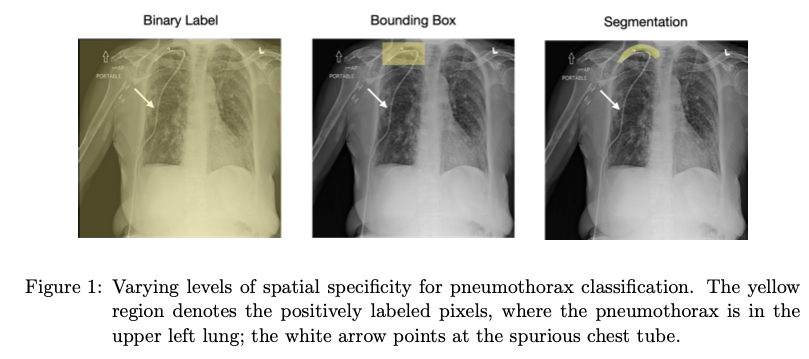

# Reducing Reliance on Spurious Features with Spatial Specificity

This reposity provides implementations and experiments for the following paper:

> **Reducing Reliance on Spurious Features in Medical Image Classification with Spatial Specificity**\
> Khaled Saab, Sarah Hooper, Mayee Chen, Michael Zhang, Daniel Rubin, and Christopher Ré\
> Machine Learning for Healthcare, 2022\
> Paper: https://web.stanford.edu/~ksaab/media/MLHC_2022.pdf




## Requirements

Package dependencies are listed in [requirements.txt](./requirements.txt).

## Codebase structure

```bash
    ├── cfg                    
        |=== config.yaml                    # default config file 
    ├── src
        ├── data                             
            |=== cxr.py                     # data loading code for CXR
            |=== isic.py                    # data loading code for ISIC
        |=== modeling.py                    # contains model architectures                   
        |=== task.py                        # main lightning module                                  
        |=== utils.py                                   
    |=== cxr_tube_dict.pkl                  # CXR tube labels             
    |=== README.md
    |=== requirements.txt     
    |=== train.py                           # main entry point      
```

### Training

The code for training models is based on [Pytorch-Lightning](https://pytorch-lightning.readthedocs.io/en/latest/). Hyperparameters and config values are defined and passed using [Hydra](https://hydra.cc/docs/intro/).

For example, to run the ResNet-50 ERM model:
```
python -m train train.method=erm train.model_type=resnet50
```
And to run the UNet Segmentation model:

```
python -m train train.method=seg train.model_type=resunet
```
### Evaluation

After a model trains, you can load the model and evaluate its performance on different subgroups. Check out our notebook `notebooks/cxr_evaluation.ipynb` for an example.

## Datasets

- CXR Pneumothorax Segmentation Data
    - CXR images/masks: the public SIIM-ACR Pneumothorax dataset was used, which can be found here: https://www.kaggle.com/c/siim-acr-pneumothorax-segmentation. 
    - **Tube labels**: To evaluate robustness to the chest tube spurious feature, we hand labeled 1,951 CXRs for tubes, which we are publicly releasing. The labels can be found in the file `cxr_tube_dict.pkl`, which is a dictionary where the keys are the CXR file names, and the values are the binary labels indicating the existence of a tube in the CXR.


## Citation

If you use our code, labeled data, or found our work valuable, please cite:

```
@article{saab2022reducing,
  title={Reducing Reliance on Spurious Features in Medical Image Classification with Spatial Specificity},
  author={Saab, Khaled and Hooper, Sarah and Chen, Mayee and Zhang, Michael and Rubin, Daniel and R{\'e}, Christopher},
  journal={Machine Learning for Healthcare Conference},
  year={2022},
  organization={PMLR}
}
```